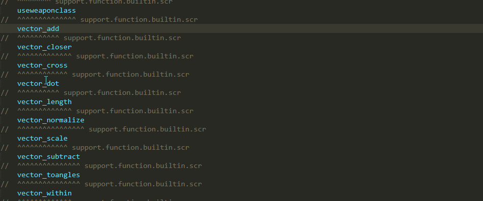
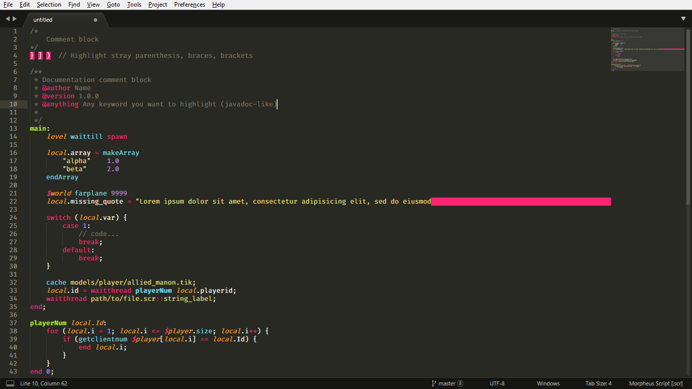
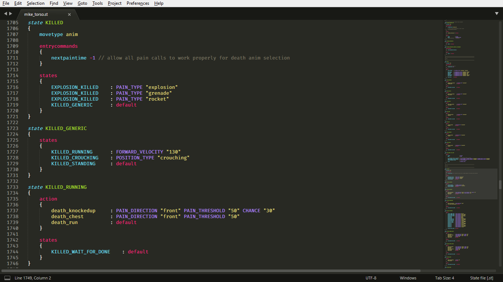
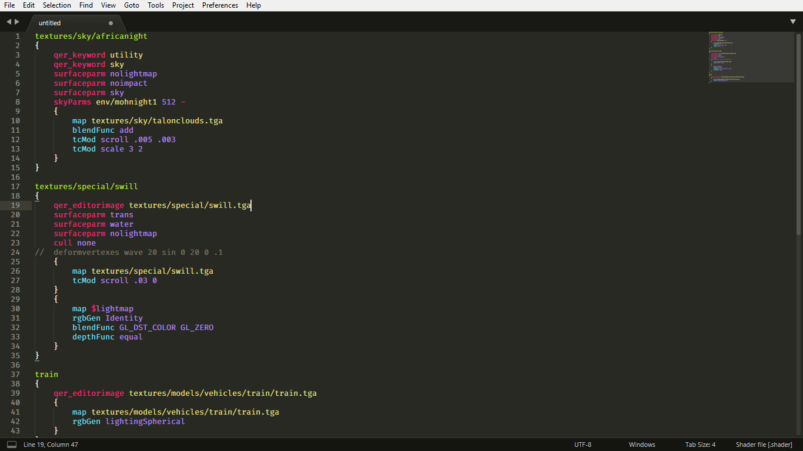
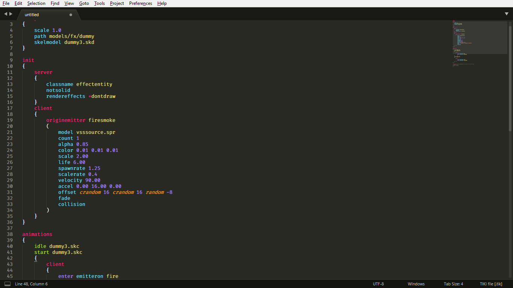
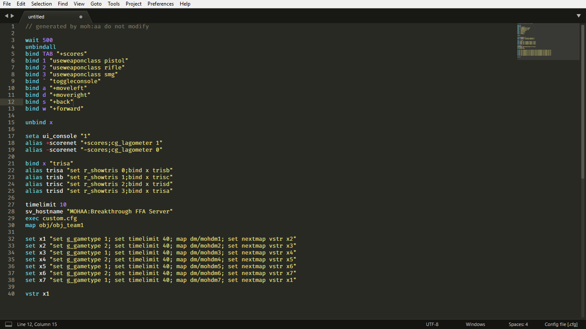
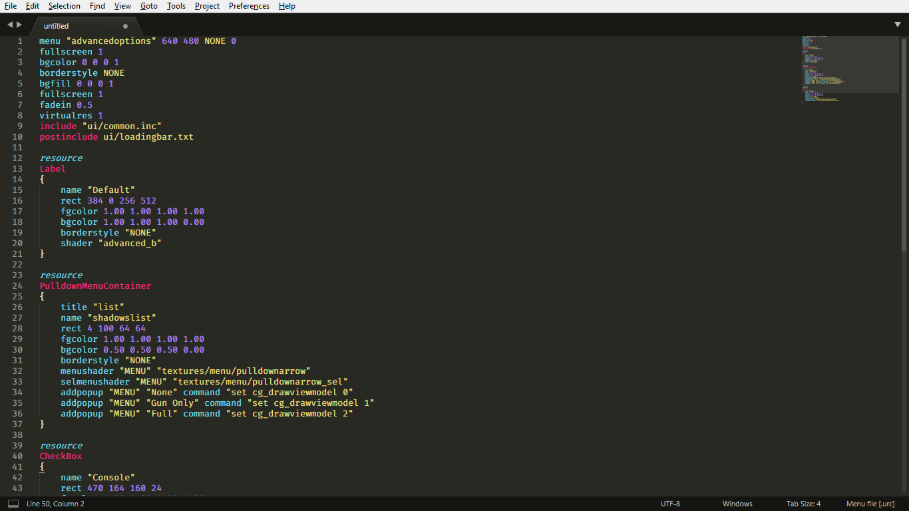
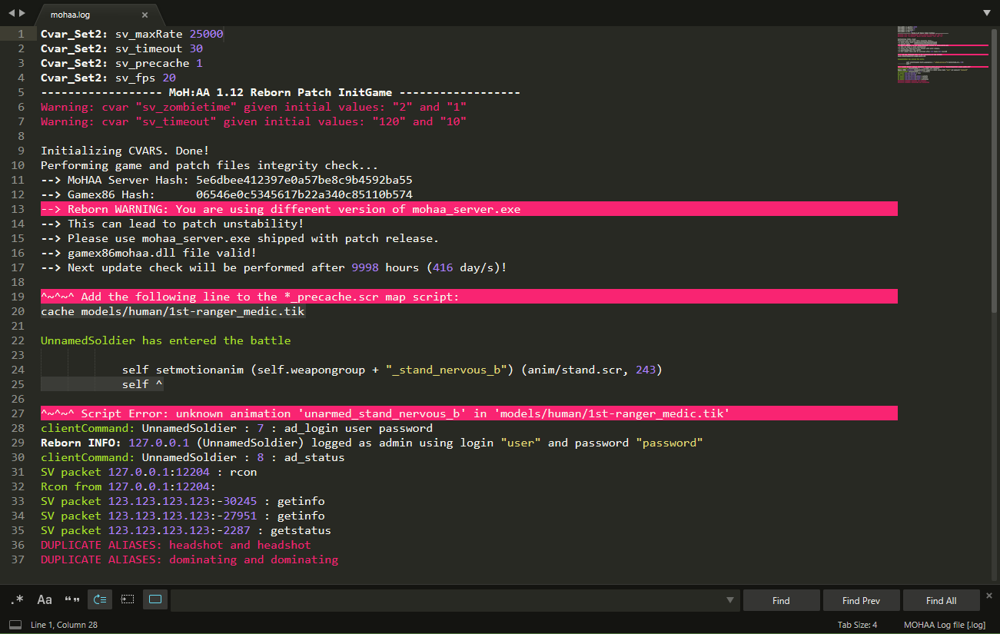
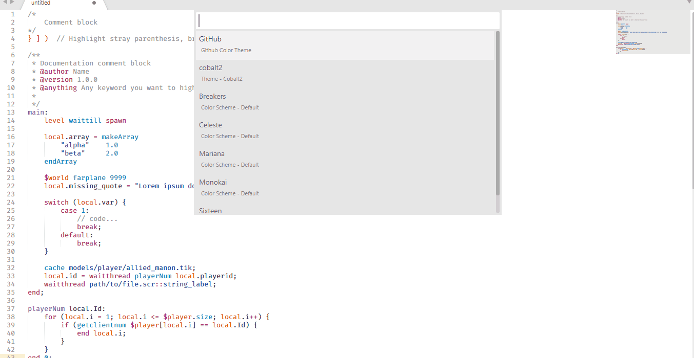

# MOHAA Syntax Highlighting for Sublime Text.
## Syntax Definitions for [Medal of Honor: Allied Assault](https://en.wikipedia.org/wiki/Medal_of_Honor:_Allied_Assault) scripting languages.

### This package contains:

|File Type|Syntax Highlighting|Completions|Snippets|
|---------|:-----------------:|:---------:|:------:|
|`.scr` Morpheus Script files|✔|✔|✔|
|`.tik` TIKI files|✔|❌|❌|
|`.st` State Machine files|✔|❌|❌|
|`.urc` Uber Resource Script files|✔|❌|❌|
|`.mus` Music files|✔|❌|❌|
|`.shader` Shader files|✔|❌|❌|
|`.cfg` Config files|✔|✔|❌|
|`.log` Server log files|✔|❌|❌|

#### Tooltips:

This package contains tooltips for Morpheus built-in functions (Allied Assault, Spearhead, Breakthrough and Reborn Patch)

To show a tooltip with the info about a function just click it with the cursor

To disable the tooltips, go to:
`Preferences -> Package Settings -> MOHAA -> Settings`
and set `"show_tooltips"` to `false` (in the right side panel)
_____________________________________________________________

### Installation

1. [Install Package Control](https://packagecontrol.io/installation) if you haven't yet.
2. Open the command palette (<kbd>Ctrl</kbd>+<kbd>Shift</kbd>+<kbd>P</kbd> for Windows & Linux,<kbd>Cmd</kbd>+<kbd>Shift</kbd>+<kbd>P</kbd> for Mac)
3. Search for _Package Control: Install Package_ and hit <kbd>Enter</kbd>.
4. Type `MOHAA` and press <kbd>Enter</kbd> to install it.

_____________________________________________________________

### Screenshots

**Tooltips**  

**Morpheus Script**  

**State files**  

**Shader files**  

**TIKI files**  

**Config files**  

**Menu files**  

**Music files**  

**Log files**  

_____________________________________________________________

**Light & Dark Themes**  

