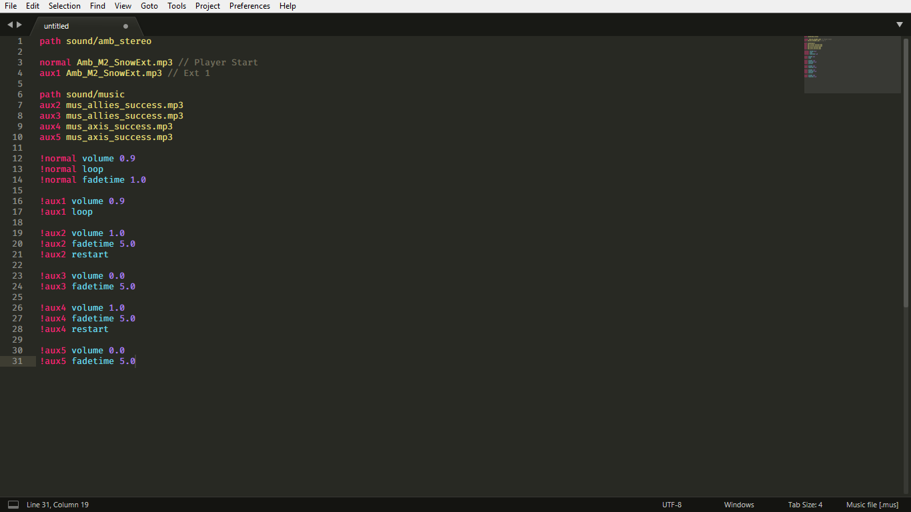
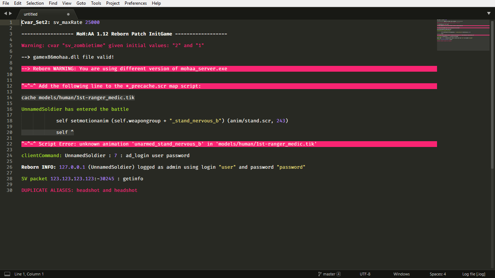

# MOHAA Syntax Highlighting for Sublime Text.
## Syntax Definitions for [Medal of Honor: Allied Assault](https://en.wikipedia.org/wiki/Medal_of_Honor:_Allied_Assault) scripting languages.

### The currently supported file types are:

* [x] `.scr` Morpheus Script files. (*Syntax Highlighting, Completions & Snippets.*)
* [x] `.st` State files. (*Syntax Highlighting.*)
* [x] `.shader` Shader files. (*Syntax Highlighting.*)
* [x] `.tik` TIKI files. (*Syntax Highlighting.*)
* [x] `.cfg` Config files. (*Syntax Highlighting & Completions*)
* [x] `.urc` Menu files. (*Syntax Highlighting.*)
* [x] `.mus` Music files. (*Syntax Highlighting.*)
* [x] `.log` Server log files. (*Syntax Highlighting.*)

_____________________________________________________________

### Installation

1. [Install Package Control](https://packagecontrol.io/installation) if you haven't yet.
2. Open the command palette (<kbd>Ctrl</kbd>+<kbd>Shift</kbd>+<kbd>P</kbd> for Windows & Linux,<kbd>Cmd</kbd>+<kbd>Shift</kbd>+<kbd>P</kbd> for Mac)
3. Search for _Package Control: Install Package_ and hit <kbd>Enter</kbd>.
4. Type `MOHAA` and press <kbd>Enter</kbd> to install it.

_____________________________________________________________

### Screenshots

**Morpheus Script**  

**State files**  

**Shader files**  

**TIKI files**  

**Config files**  

**Menu files**  

**Music files**  

**Log files**  

_____________________________________________________________

**Light & Dark Themes**  

